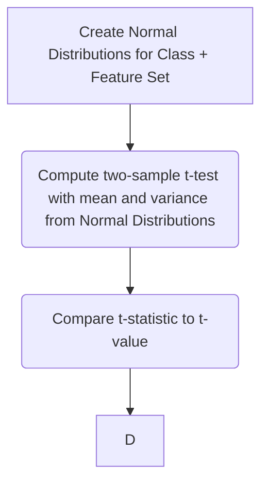

```mermaid
  flowchart TD;
      A[Create Normal Distributions for Class + Feature Set] --> B(Compute two-sample t-test with mean and variance from Normal Distributions);
      B --> C(Compare t-statistic to t-value)
      C-->D;
```
