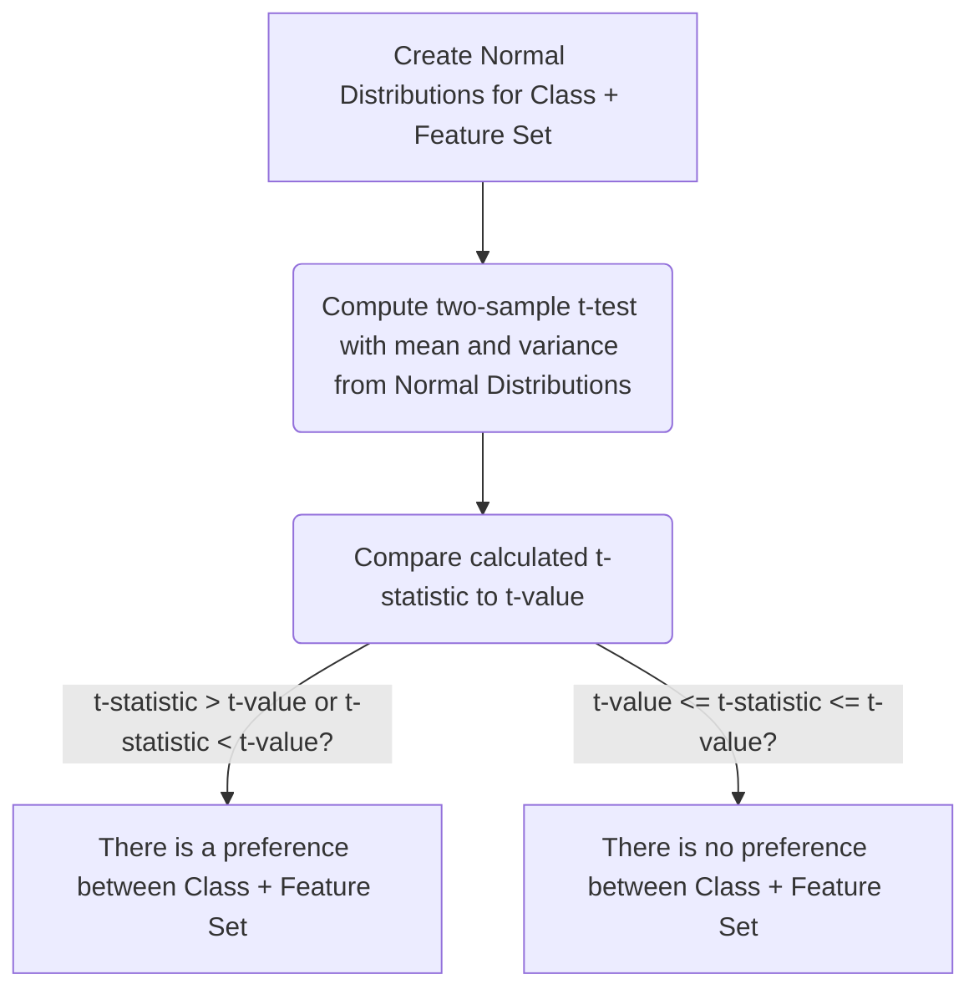

```mermaid
  flowchart TD;
      A[Create Normal Distributions for Class + Feature Set] --> B(Compute two-sample t-test with mean and variance from Normal Distributions);
      B --> C(Compare calculated t-statistic to t-value);
      C -- t-statistic > t-value or t-statistic < t-value? --> D[There is a preference between Class + Feature Set];
      C -- t-value <= t-statistic <= t-value? --> F[There is no preference between Class + Feature Set];
    
```
