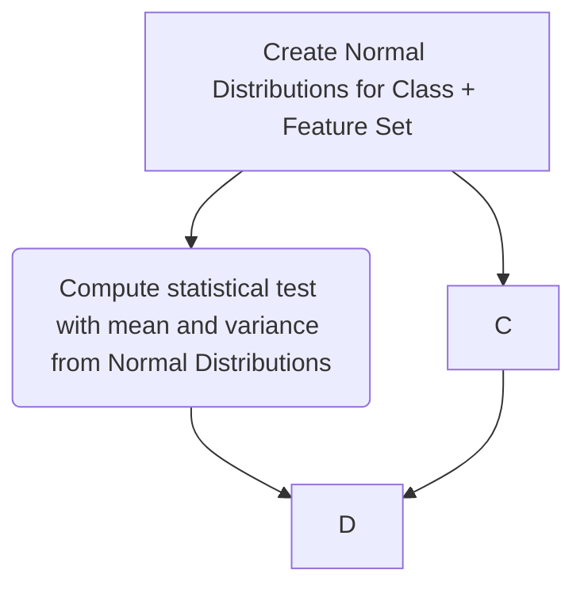

```mermaid
  flowchart TD;
      A[Create Normal Distributions for Class + Feature Set] --> B(Compute statistical test with mean and variance from Normal Distributions);
      A-->C;
      B-->D;
      C-->D;
```
