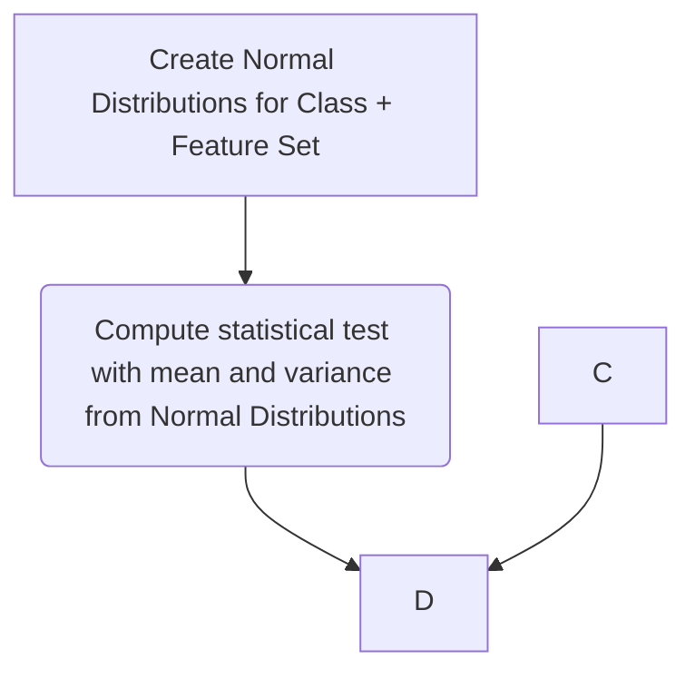

```mermaid
  flowchart TD;
      A[Create Normal Distributions for Class + Feature Set] --> B(Compute statistical test with mean and variance from Normal Distributions);
      B-->D;
      C-->D;
```
